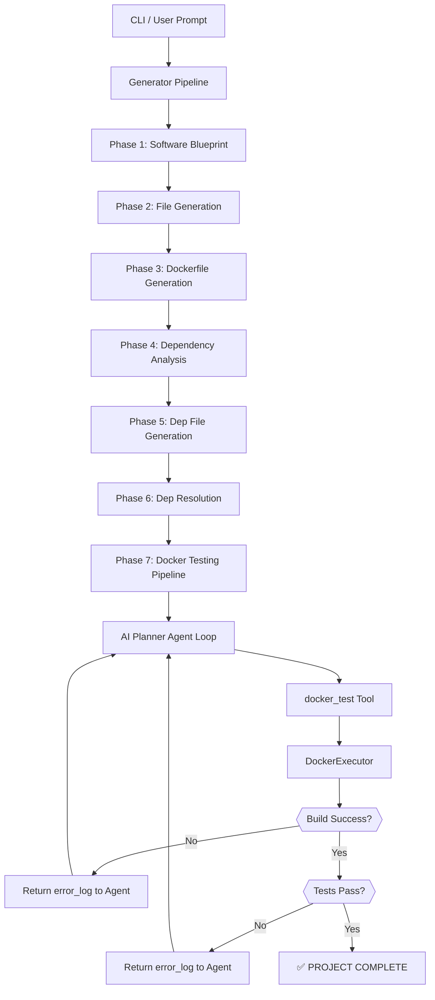

# Alpha Stack — Architecture Deep Dive

> **Alpha Stack** is an AI-driven code generation and validation system. Given a natural language prompt, it fully generates a working software project — source code, dependency files, Dockerfile — and then autonomously runs it, debugs it using an AI Planner Agent, and verifies it passes all tests inside a Docker container.

---

## System Overview



---

## Top-Level Directory Structure

```
iteration-1_alpha_stack/
├── src/                    # Core application source
│   ├── generator.py        # Main 7-phase generation pipeline
│   ├── cli.py              # Command-line interface entry point
│   ├── tui.py              # Terminal UI (live build status)
│   ├── config.py           # Environment and config loading
│   ├── providers.json      # LLM provider definitions
│   ├── docker/             # Docker build/test execution layer
│   ├── utils/              # Shared utilities (tools, inference, etc.)
│   └── prompts/            # All Jinja2 prompt templates
├── eval/                   # MBPP benchmark evaluation
├── test_output/            # Generated project output directory
├── test_runner.py          # Quick local test harness
└── website/                # Project landing page (Next.js)
```

---

## Core Components

### 1. `src/cli.py` — Entry Point

The CLI is the user-facing interface. It accepts a problem prompt and drives the entire generation pipeline. It handles:
- Argument parsing (`--provider`, `--output-dir`, etc.)
- Instantiating and calling `GeneratorPipeline`
- Displaying results and error summaries to the terminal

**Access granted:** Everything. It is the top-level orchestrator.

---

### 2. `src/generator.py` — 7-Phase Generation Pipeline

The heart of the system. This class runs sequentially through 7 well-defined phases to produce a complete project from scratch:

| Phase | Name | What it Does |
|-------|------|--------------|
| 1 | Blueprint | Generates a `software_blueprint` JSON from the user prompt. Defines all files, their purpose, and module structure. |
| 2 | File Generation | For each file in the blueprint, calls the LLM to generate the actual code. |
| 3 | Dockerfile Generation | Generates a production Dockerfile appropriate for the language and project structure. |
| 4 | Dependency Analysis | Runs static analysis to build an internal import/dependency graph across all generated files. |
| 5 | Dep Files Generation | Based on the dependency graph, generates language-appropriate dependency files (`requirements.txt`, `package.json`, `Cargo.toml`, etc.). |
| 6 | Dep Resolution | Resolves and validates the dependency files (e.g., checks package names). |
| 7 | Docker Testing Pipeline | Hands off to the AI Planner Agent loop to build, run, and iteratively fix the code. |

**Access granted:** LLM (via `InferenceManager`), file system (write), `PromptManager`, `ErrorTracker`.

---

### 3. `src/docker/testing.py` — Docker Execution & Planner Agent

This file contains three key classes:

#### `PipelineState`
A Pydantic model tracking the real-time state of the current testing session:
- `build_success`, `test_success`: whether Docker build/tests have passed
- `session`: current iteration count
- `last_build_logs`, `last_test_logs`: the most recent log output

#### `DockerExecutor`
The low-level subprocess manager. It is the only component that actually runs Docker commands on the host machine:
- **`build(command?)`**: Runs `docker build` with live streaming output. Implements stall detection (kills after 250s of no output) and a hard 10-minute timeout. Captures all logs.
- **`run(command)`**: Runs `docker run` synchronously with a 120 second timeout. Detects if it is a test command and updates `test_success` state accordingly.

**Access granted:** `subprocess`, host file system (read only, via `cwd`), network (implicit via Docker).

#### `DockerTestingPipeline`
The AI Planner Agent orchestrator. It owns the entire agentic loop:
- Builds the system prompt using `_build_planner_prompt()` at the start of every session, injecting current state, file structure, and tool memory.
- Calls the LLM with the full planner prompt and registered tool definitions.
- Parses function calls from the LLM response and dispatches them via `ToolHandler`.
- Runs **non-Docker tools in parallel** using a `ThreadPoolExecutor` for speed.
- Runs **Docker tools exclusively** (one at a time) to avoid conflicts.
- Loops for up to `max_sessions = 25` outer sessions, each with up to `max_rounds_per_session = 15` LLM turns.
- Exits early the moment `build_success AND test_success` are both true.

**Access granted:** LLM, `ToolHandler` (which has full tool access), `DockerExecutor`.

---

### 4. `src/docker/generator.py` — Dockerfile Generator

A focused submodule responsible only for generating the `Dockerfile` and `.dockerignore` for the project. It uses the `software_blueprint` and the project structure to produce the appropriate Docker build instructions for the target language.

**Access granted:** LLM, Project file system (read).

---

### 5. `src/utils/tools.py` — Tool Handler

The `ToolHandler` class is the bridge between the LLM's textual tool-call intentions and the actual Python functions that execute them. It acts as a unified dispatcher:

| Tool | What it Does | Access |
|------|-------------|--------|
| `get_file_code` | Read file contents from project | FS Read |
| `update_file_code` | Overwrite a file with new code | FS Write |
| `patch_file` | Surgical line-level file edits | FS Write |
| `run_shell_command` | Execute a read-only shell command | Subprocess |
| `docker_test` | Build image + run tests (combined) | DockerExecutor |
| `batch_read_files` | Read multiple files in parallel | FS Read (parallel) |
| `batch_edit_files` | Edit multiple files via sub-agents | FS Write (parallel) |
| `get_file_dependencies` | Get internal imports of a file | DependencyAnalyzer |
| `get_file_dependents` | Get what imports a given file | DependencyAnalyzer |
| `get_error_history` | Fetch past errors from tracker | ErrorTracker |
| `get_action_history` | Fetch past actions from tracker | ErrorTracker |
| `give_up` | Signal unrecoverable failure | Pipeline Control |

---

### 6. `src/utils/tool_definitions.py` — Tool Schema Registry

Defines all tools in JSON Schema format (compatible with OpenAI, Anthropic, and OpenRouter function calling APIs). Also defines which tools are available to which agent:

- **`PLANNER_TOOL_NAMES`**: The full set of tools the Planner Agent can call (all tools).
- **`EXECUTOR_TOOL_NAMES`**: A restricted set for corrector sub-agents (file read/write only, no Docker, no recursion).

---

### 7. `src/utils/inference.py` — LLM Provider Abstraction

An abstraction layer over multiple LLM providers. This allows the system to switch between providers without changing any calling code:

- Supported providers: **OpenAI**, **Anthropic**, **OpenRouter**, **Prime Intellect**
- Each provider implements a common interface: `call_model()`, `format_tools()`, `extract_function_calls()`, `create_function_response()`, `accumulate_messages()`
- Provider config is loaded from `src/providers.json`

---

### 8. `src/utils/thread_memory.py` — Thread Memory

A rolling context window for the Planner Agent. Instead of sending the entire history of every tool call to the LLM on every turn (which would blow up the context window), `ThreadMemory` keeps only the most recent tool interactions and summarizes older ones using the LLM. This keeps the planner's prompt lean and focused.

---

### 9. `src/utils/error_tracker.py` — Error Tracker

Persists every error and file change the agent makes during a session to a JSON file (`.alpha_stack/error_tracker.json`). This lets the planner query historical error data with `get_error_history` to avoid repeating the same failed fixes.

---

### 10. `src/utils/dependencies.py` — Dependency Analyzer

Performs static analysis of the generated codebase to build an internal dependency graph. This is used to:
- Feed the dependency structure to the Planner Agent prompt
- Identify which files depend on each other, so the agent can make informed changes

---

### 11. `src/prompts/` — Jinja2 Prompt Templates

All LLM prompts are stored as `.j2` (Jinja2) templates for clean separation of logic and content. Key templates:

| Template | Purpose |
|----------|---------|
| `project_blueprint.j2` | System prompt for Phase 1 — generates the project's file plan |
| `planner_pipeline.j2` | System prompt for the AI Planner Agent — drives the fix/test loop |
| `dockerfile_generation.j2` | Prompt for generating the Dockerfile |
| `test_dockerfile_blueprint.j2` | Prompt for generating a test-ready Dockerfile variant |
| `eval/*/` | 40 evaluation prompts across CUDA, Go, Rust, and TypeScript |

---

## Data Flow: End to End

```
User Input (natural language prompt)
    │
    ▼
[Phase 1] Software Blueprint (JSON)
    - Files list, module roles, language, dependencies
    │
    ▼
[Phase 2] Code Generation
    - Each file independently generated from blueprint
    │
    ▼
[Phase 3] Dockerfile Generation
    - Language-appropriate build instructions
    │
    ▼
[Phase 4+5] Dependency Analysis & File Generation
    - Static import graph → requirements.txt / package.json / Cargo.toml
    │
    ▼
[Phase 7] Docker Testing Pipeline
    ┌──────────────────────────────────────┐
    │  Planner Prompt (state + blueprint + │
    │  file tree + dep graph + memory)     │
    │               │                      │
    │  LLM Response (tool calls)           │
    │               │                      │
    │  ToolHandler dispatches:             │
    │    - Read/write files                │
    │    - docker_test → build + run       │
    │               │                      │
    │  Results fed back to LLM             │
    │  Repeat up to 25 sessions            │
    └──────────────────────────────────────┘
    │
    ▼
✅ success: true, build_success: true, tests_success: true
```

---

## Agent Access Control Summary

| Component | LLM Access | FS Read | FS Write | Docker | Network |
|-----------|-----------|---------|---------|--------|---------|
| Generator Pipeline | ✅ | ✅ | ✅ | ❌ | ❌ |
| Planner Agent | ✅ | ✅ (via tools) | ✅ (via tools) | ✅ (via docker_test) | ❌ |
| Corrector Sub-Agent | ✅ | ✅ | ✅ | ❌ | ❌ |
| DockerExecutor | ❌ | ✅ (cwd only) | ❌ | ✅ | Implicit |
| ToolHandler | ❌ | ✅ | ✅ | Delegates | Delegates |
