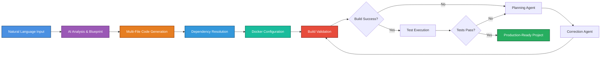

<div align="center">
  
</div>

# AlphaStack

**AI-powered project generator that transforms natural language descriptions into complete, production-ready codebases with Docker configurations and automated testing.**

> 📄 **Paper submitted to ICML 2026**  
> A novel approach to autonomous code generation using multi-agent systems with iterative self-healing and comprehensive validation across diverse programming paradigms.

---

## 🎯 Key Features

### **Intelligent Multi-Agent Architecture**
- **Planning Agent**: Analyzes errors and generates comprehensive fix strategies using tool-augmented reasoning
- **Correction Agent**: Executes fixes with code understanding and validation
- **Iterative Self-Healing**: Automatically detects and resolves dependency conflicts, build errors, and test failures

### **Comprehensive Code Generation**
- Natural language to production-ready code
- Multi-file project generation with proper structure
- Support for modern languages and frameworks
- Intelligent dependency resolution
- Best practices and design patterns

### **Docker-Based Validation**
- Automated Docker container creation
- Isolated build and test environments
- Resource-managed execution (configurable CPU/memory limits)
- Complete validation pipeline from build to test execution

### **Extensive Evaluation Framework**
- **40 Programming Challenges** across 4 languages:
  - **CUDA**: GPU computing and parallel algorithms (10 challenges)
  - **Go**: Concurrent systems and distributed computing (10 challenges)
  - **Rust**: Memory-safe systems programming (10 challenges)
  - **TypeScript**: Type-safe applications and frameworks (10 challenges)
- **4-Tier Difficulty System**: From fundamentals to production systems
- Comprehensive benchmarking and metrics collection

---

## How It Works



### Architecture Components

**Core Generation Pipeline:**
- **Blueprint Generation**: Analyzes requirements and creates software architecture
- **Folder Structure**: Generates project hierarchy with proper organization
- **File Generation**: Creates all necessary files with content (source, config, tests, docs)
- **Metadata Management**: Tracks dependencies, entry points, and test commands

**Intelligent Error Resolution:**
- **Error Tracking**: Monitors all errors across build and test phases
- **Tool-Augmented Planning**: Uses file operations, command execution, and analysis tools
- **Context-Aware Fixes**: Understands project structure and dependencies
- **Iterative Refinement**: Continues until success or max iterations reached

**Validation & Testing:**
- **Docker Isolation**: Sandboxed build and test environments
- **Command Detection**: Automatically identifies build/test commands
- **Log Analysis**: Extracts and analyzes error messages
- **Success Verification**: Validates complete pipeline execution

---

## Installation

**Requirements:** 
- Python 3.9+
- [Google Gemini API Key](https://makersuite.google.com/app/apikey)
- Docker (optional, for validation)

```bash
# Clone and install
git clone https://github.com/HyperKuvid-Labs/alpha-stack.git
cd alpha-stack
pip install .

# Configure API key
alphastack setup
```

**Docker Installation (Recommended):**
```bash
# Install Docker Engine (Linux)
curl -fsSL https://get.docker.com -o get-docker.sh
sudo sh get-docker.sh

# Or via package manager (Ubuntu/Debian)
sudo apt-get update
sudo apt-get install docker-ce docker-ce-cli containerd.io
```

## Usage

**Interactive Mode:**
```bash
alphastack
# Follow the interactive prompts to generate your project
```

**Command Line:**
```bash
# Generate a project
alphastack generate "A Flask REST API with user authentication and JWT tokens"

# Specify output directory
alphastack generate "Python CLI tool for file processing" -o /path/to/output

# Generate with custom name
alphastack generate "React TypeScript dashboard with charts"

# List generated projects
alphastack list

# Clean up projects
alphastack clean
```

**Example Projects:**
```bash
# Web Applications
alphastack generate "Express.js REST API with MongoDB and authentication"
alphastack generate "FastAPI service with PostgreSQL and async operations"

# CLI Tools
alphastack generate "Python CLI tool for image compression with progress bar"
alphastack generate "Go CLI for log analysis with concurrent processing"

# Data Processing
alphastack generate "Rust program for parallel CSV processing"
alphastack generate "Python script for web scraping with retry logic"

# System Programming
alphastack generate "CUDA kernel for matrix multiplication optimization"
alphastack generate "Go service with gRPC and protocol buffers"
```

---

## 🔬 Research & Evaluation

### Evaluation Suite

AlphaStack includes a comprehensive evaluation framework with **40 carefully designed programming challenges** across 4 modern languages, organized into 4 difficulty tiers:

#### **CUDA (GPU Computing)**
- **Focus**: Parallel computing, memory management, kernel optimization
- **Challenges**: Vector operations → Matrix operations → Sparse algorithms → Ray tracing engines
- **Tier 4 Example**: Ray tracing engine with BVH acceleration structure

#### **Go (Concurrent Systems)**
- **Focus**: Distributed systems, goroutines, channels, service architecture
- **Challenges**: Worker pools → REST APIs → Load balancers → Raft consensus
- **Tier 4 Example**: Full Raft consensus protocol implementation

#### **Rust (Systems Programming)**
- **Focus**: Memory safety, ownership, lifetimes, zero-cost abstractions
- **Challenges**: Custom iterators → HTTP parsers → Procedural macros → Custom allocators
- **Tier 4 Example**: Custom bump allocator as global allocator with FFI

#### **TypeScript (Type-Safe Applications)**
- **Focus**: Type system, generics, inference, compile-time safety
- **Challenges**: Event emitters → Type-safe routers → DI containers → Full-stack RPC
- **Tier 4 Example**: End-to-end type-safe RPC framework with inference

### Difficulty Progression

| Tier | Focus | Complexity | Lines of Code | Time |
|------|-------|------------|---------------|------|
| **Tier 1** | Fundamentals | Single concept, basic algorithms | 150-400 | 2-4h |
| **Tier 2** | Architecture | Multiple modules, abstractions | 400-700 | 4-8h |
| **Tier 3** | Advanced | Domain expertise, algorithms | 500-900 | 8-16h |
| **Tier 4** | Production | Complete systems, optimization | 800-1500 | 16-32h |

### Evaluation Metrics

- **Success Rate**: Percentage of challenges solved correctly
- **Build Success**: Projects that compile/build without errors
- **Test Pass Rate**: Projects with passing test suites
- **Iteration Count**: Average iterations needed for error resolution
- **Time to Solution**: End-to-end generation time
- **Code Quality**: Adherence to best practices and patterns

**Evaluation Location**: `src/prompts/eval/` contains all challenge specifications and test cases.

---

## 🏗️ Project Structure

```
alpha-stack/
├── src/
│   ├── agents/                  # Multi-agent system
│   │   ├── planner.py          # Planning agent for error analysis
│   │   └── corrector.py        # Correction agent for fixes
│   ├── docker/                  # Docker integration
│   │   ├── generator.py        # Dockerfile generation
│   │   └── testing.py          # Docker-based validation
│   ├── prompts/                 # Jinja2 prompt templates
│   │   └── eval/               # Evaluation challenges
│   │       ├── cuda/           # 10 CUDA challenges
│   │       ├── go/             # 10 Go challenges
│   │       ├── rust/           # 10 Rust challenges
│   │       └── typescript/     # 10 TypeScript challenges
│   ├── utils/                   # Core utilities
│   │   ├── helpers.py          # Helper functions
│   │   ├── prompt_manager.py   # Template management
│   │   ├── error_tracker.py    # Error tracking
│   │   └── tools.py            # Tool definitions
│   ├── generator.py             # Main generation logic
│   ├── eval_generator.py        # Evaluation system
│   ├── cli.py                   # Command-line interface
│   ├── tui.py                   # Terminal UI
│   └── config.py                # Configuration management
├── website/                     # Project website
├── test_runner.py               # Development test runner
└── pyproject.toml              # Project metadata
```

---

## 🔧 Technical Details

### AI Model
- **Primary Model**: Google Gemini (configurable via `MODEL_NAME`)
- **Alternative Support**: OpenRouter API for evaluation framework
- **Context Management**: Intelligent prompt engineering with Jinja2 templates

### Multi-Agent System

**Planning Agent** (`src/agents/planner.py`):
- Analyzes build/test errors using structured error tracking
- Generates comprehensive fix plans with tool-based reasoning
- Maintains project structure cache for efficient planning
- Supports different error types (dependency, docker, common errors)

**Correction Agent** (`src/agents/corrector.py`):
- Executes planned fixes with code understanding
- Validates code changes before application
- Uses language-specific parsers for syntax validation
- Tracks changes to prevent infinite loops

### Docker Integration

**Features**:
- Automatic Dockerfile generation based on project type
- Multi-stage builds for optimized images
- Resource management (configurable CPU/memory limits)
- Network isolation and security
- Support for custom base images

**Testing Framework** (`src/docker/testing.py`):
- Command detection (build, test, run commands)
- Real-time log capture and analysis
- Iterative error resolution with max iteration limits
- Success/failure validation with detailed reporting

### Prompt Engineering

**Template System**:
- Jinja2-based prompt templates for consistency
- Context-aware prompt rendering
- Specialized templates for different generation phases:
  - Software blueprint generation
  - Folder structure planning
  - File content generation
  - Error correction strategies
  - Docker configuration

---

## 📊 Performance & Capabilities

### Generation Capabilities
- **Languages**: Python, JavaScript/TypeScript, Go, Rust, Java, C/C++, CUDA, and more
- **Frameworks**: Flask, FastAPI, Express.js, React, Vue, Next.js, etc.
- **Project Types**: Web APIs, CLI tools, data processors, system utilities, GPU kernels
- **File Types**: Source code, configuration, tests, documentation, Docker files

### Self-Healing Iterations
- **Dependency Resolution**: Automatically resolves missing packages and version conflicts
- **Build Fixes**: Corrects syntax errors, import issues, configuration problems
- **Test Fixes**: Addresses failing tests, missing test dependencies, assertion errors
- **Max Iterations**: Configurable (default: 5 per phase)

### Docker Validation
- **Build Time**: Typically 1-5 minutes depending on project complexity
- **Test Execution**: Isolated environment with resource limits
- **Success Rate**: High success rate on Tier 1-2 challenges (>80%)
- **Resource Usage**: Configurable memory (default: 25% of system) and CPU (default: 50%)

---

## 🎓 Academic Context

This work introduces a novel approach to autonomous code generation that addresses key challenges in AI-assisted software development:

### Key Contributions

1. **Multi-Agent Architecture**: Separation of planning and correction concerns for better error resolution
2. **Iterative Self-Healing**: Autonomous error detection and correction without human intervention
3. **Comprehensive Validation**: End-to-end validation from build to test execution in isolated environments
4. **Cross-Language Evaluation**: Diverse evaluation suite spanning different programming paradigms
5. **Tool-Augmented Reasoning**: Integration of file operations and command execution for context-aware fixes

### Research Questions

- How effectively can multi-agent systems autonomously resolve software errors?
- What is the success rate across different programming paradigms and difficulty levels?
- How many iterations are typically required for convergence to a working solution?
- What types of errors can be automatically resolved vs. requiring human intervention?

### Evaluation Methodology

The evaluation framework (`src/prompts/eval/`) provides a standardized benchmark with:
- 40 challenges across 4 languages and 4 difficulty tiers
- Clear success criteria (build success, test pass rate)
- Reproducible evaluation in Docker containers
- Metrics for iteration count, time to solution, and code quality

**For more details on the evaluation suite, see** [`src/prompts/eval/README.md`](src/prompts/eval/README.md)

---

## 🤝 Contributing

We welcome contributions! Areas of interest:
- Additional programming language support
- New evaluation challenges
- Performance optimizations
- Documentation improvements
- Bug fixes and error handling

---

## 📜 License

MIT License - see [LICENSE](LICENSE) file for details

---

## 🔗 Links

- **Repository**: [github.com/HyperKuvid-Labs/alpha-stack](https://github.com/HyperKuvid-Labs/alpha-stack)
- **Issues**: [github.com/HyperKuvid-Labs/alpha-stack/issues](https://github.com/HyperKuvid-Labs/alpha-stack/issues)
- **Evaluation Suite**: [src/prompts/eval/](src/prompts/eval/)

---

## 📧 Contact

For research collaborations or questions about the ICML 2026 submission, please open an issue or contact the AlphaStack Team.

---

<div align="center">
  <p><strong>AlphaStack</strong> - Transforming Ideas into Code</p>
  <p><em>Submitted to ICML 2026</em></p>
</div>
