<div align="center">
  
</div>

# AlphaStack

AI-powered project generator that transforms natural language descriptions into complete, production-ready codebases with Docker configurations and automated testing.

## How It Works

```mermaid
graph LR
    A[Natural Language Input] --> B[AI Analysis]
    B --> C[Code Generation]
    C --> D[Dependency Resolution]
    D --> E[Docker Configuration]
    E --> F[Testing & Validation]
    F --> G[Production-Ready Project]

    style A fill:#4A90E2,stroke:#2E5C8A,stroke-width:2px,color:#fff
    style B fill:#9B59B6,stroke:#6C3483,stroke-width:2px,color:#fff
    style C fill:#E67E22,stroke:#A04000,stroke-width:2px,color:#fff
    style D fill:#3498DB,stroke:#1F618D,stroke-width:2px,color:#fff
    style E fill:#1ABC9C,stroke:#117A65,stroke-width:2px,color:#fff
    style F fill:#E74C3C,stroke:#922B21,stroke-width:2px,color:#fff
    style G fill:#27AE60,stroke:#186A3B,stroke-width:2px,color:#fff
```



## Installation

**Requirements:** Python 3.9+, [Google Gemini API Key](https://makersuite.google.com/app/apikey), Docker (optional)

```bash
# Clone and install
pip install .

# Configure API key
alphastack setup
```

## Usage

**Interactive Mode:**
```bash
alphastack
```

**Command Line:**
```bash
# Generate a project
alphastack generate "A Flask REST API with user authentication"

# Specify output directory
alphastack generate "Python CLI tool" -o /path/to/output

# List generated projects
alphastack list

# Clean up projects
alphastack clean
```
