<div align="center">
  
</div>

# AlphaStack

**AI-Powered Project Generator with Docker Testing**

AlphaStack is an intelligent project generation tool that uses Google's Gemini AI to create complete software projects from natural language descriptions. It features an interactive terminal user interface (TUI), automatic dependency resolution, Docker containerization, and comprehensive testing capabilities.

## What is AlphaStack?

AlphaStack takes your project idea and transforms it into a fully functional codebase. It:

- **Generates complete project structures** - Creates folder hierarchies, files, and code based on your requirements
- **Resolves dependencies automatically** - Analyzes and fixes dependency issues iteratively
- **Creates Docker configurations** - Generates Dockerfiles and docker-compose files automatically
- **Runs comprehensive tests** - Tests Docker builds and validates project functionality
- **Provides error correction** - Uses AI agents to fix common errors and issues
- **Offers interactive TUI** - Beautiful terminal interface with real-time progress updates

The tool uses a multi-agent system with planners and correctors to iteratively improve generated code, ensuring high-quality output that's ready to use.

## System Architecture and Flow

```mermaid
graph TD
    A[User Input<br/>Natural Language Description] --> B[CLI / TUI Interface<br/>cli.py / tui.py / config.py]

    B --> C[Generator Orchestrator<br/>generator.py]

    C --> C1[1. Software Blueprint Generation]
    C1 --> C2[2. Folder Structure Planning]
    C2 --> C3[3. File Format Contract Definition]
    C3 --> C4[4. Code Generation]

    C4 --> D[Agent System<br/>agents/planner.py<br/>agents/corrector.py]
    C4 --> E[Prompt Management<br/>prompts/*.j2<br/>utils/prompt_manager.py]

    D --> D1[• Planning Agent<br/>• Correction Agent<br/>• Multi-iteration Refinement]
    E --> E1[• Jinja2 Templates<br/>• Dynamic Prompt Construction<br/>• Context Management]

    E1 -.-> D1

    D1 --> F[Dependency Resolution<br/>utils/dependencies.py]

    F --> F1[• Analyze project dependencies<br/>• Detect missing packages<br/>• Iterative resolution with AI]

    F1 --> G[Docker Integration<br/>docker/generator.py<br/>docker/testing.py]

    G --> G1[• Dockerfile generation<br/>• Docker Compose configuration<br/>• Container build and testing]

    G1 --> H[Error Tracking & Correction<br/>utils/error_tracker.py<br/>utils/command_log.py]

    H --> H1[• Track build/test errors<br/>• AI-powered error analysis<br/>• Automated correction suggestions<br/>• Command execution logging]

    H1 --> I[Validated Project Output<br/>• Complete source code<br/>• Docker configuration<br/>• Test files<br/>• Project metadata]

    style A fill:#4A90E2,stroke:#2E5C8A,stroke-width:2px,color:#fff
    style B fill:#50C878,stroke:#2E7D4E,stroke-width:2px,color:#fff
    style C fill:#9B59B6,stroke:#6C3483,stroke-width:2px,color:#fff
    style D fill:#E67E22,stroke:#A04000,stroke-width:2px,color:#fff
    style E fill:#E67E22,stroke:#A04000,stroke-width:2px,color:#fff
    style F fill:#3498DB,stroke:#1F618D,stroke-width:2px,color:#fff
    style G fill:#1ABC9C,stroke:#117A65,stroke-width:2px,color:#fff
    style H fill:#E74C3C,stroke:#922B21,stroke-width:2px,color:#fff
    style I fill:#27AE60,stroke:#186A3B,stroke-width:2px,color:#fff
```



## Folder Structure

```
alpha_stack/
├── alphastack/
│   ├── __init__.py
│   ├── cli.py
│   ├── tui.py
│   ├── generator.py
│   ├── config.py
│   │
│   ├── agents/
│   │   ├── __init__.py
│   │   ├── planner.py
│   │   └── corrector.py
│   │
│   ├── docker/
│   │   ├── __init__.py
│   │   ├── generator.py
│   │   └── testing.py
│   │
│   ├── prompts/
│   │   ├── software_blueprint.j2
│   │   ├── folder_structure.j2
│   │   ├── file_content.j2
│   │   ├── dockerfile_generation.j2
│   │   ├── dep_resolution_prompt.j2
│   │   └── ... (other prompt templates)
│   │
│   └── utils/
│       ├── __init__.py
│       ├── prompt_manager.py
│       ├── dependencies.py
│       ├── error_tracker.py
│       ├── helpers.py
│       ├── command_log.py
│       └── tools.py
│
├── pyproject.toml
├── install.sh
├── install.bat
├── README.md
└── .gitignore
```

## Setup Instructions

### Prerequisites

- **Python 3.9+** - Python 3.9, 3.10, 3.11, or 3.12
- **pip** - Python package manager
- **Google Gemini API Key** - Required for AI generation ([Get one here](https://makersuite.google.com/app/apikey))
- **Docker** (optional but recommended) - For Docker testing features

### Installation

#### macOS / Linux

1. Clone or download this repository
2. Navigate to the project directory:
   ```bash
   cd iteration-1_alpha_stack
   ```
3. Run the installation script:

   ```bash
   chmod +x install.sh
   ./install.sh
   ```

   Or install manually:

   ```bash
   pip install .
   ```

#### Windows

1. Clone or download this repository
2. Navigate to the project directory in Command Prompt or PowerShell
3. Run the installation script:

   ```cmd
   install.bat
   ```

   Or install manually:

   ```cmd
   pip install .
   ```

### API Key Configuration

After installation, you need to configure your Google Gemini API key:

**Option 1: Interactive Setup (Recommended)**

```bash
alphastack setup
```

**Option 2: Environment Variable**

```bash
export GOOGLE_API_KEY="your-api-key-here"
```

**Option 3: Manual Configuration**
The API key is stored in `~/.alphastack/config.json` (or `%USERPROFILE%\.alphastack\config.json` on Windows)

## User Instructions

### Basic Usage

#### Interactive Mode (Recommended)

Simply run:

```bash
alphastack
```

This launches the interactive TUI where you can:

1. Enter your project description
2. Specify the output directory (absolute path required)
3. Watch the generation progress in real-time

#### Command Line Mode

**Generate a project:**

```bash
alphastack generate "A Flask web application for managing tasks with user authentication"
```

**Specify output directory:**

```bash
alphastack generate "A Python CLI tool" -o /path/to/output
```

**List generated projects:**

```bash
alphastack list
```

**List projects in specific directory:**

```bash
alphastack list -o /path/to/projects
```

**Clean up generated projects:**

```bash
alphastack clean
```

**Clean without confirmation:**

```bash
alphastack clean -f
```

### What Happens During Generation?

1. **Software Blueprint Creation** - AI analyzes your prompt and creates a detailed project specification
2. **Folder Structure Generation** - Creates the optimal directory structure for your project
3. **File Format Contracts** - Determines file formats and coding standards
4. **Code Generation** - Generates all source files with appropriate content
5. **Dependency Analysis** - Analyzes and resolves project dependencies
6. **Docker Configuration** - Creates Dockerfile and docker-compose files
7. **Testing** - Runs Docker builds and tests to validate the project
8. **Error Correction** - Automatically fixes common errors and issues

### Output

Generated projects are saved to the specified output directory (default: `./created_projects`). Each project includes:

- Complete source code
- Docker configuration files
- Test files
- Project metadata

### Tips

- **Be specific** - More detailed prompts yield better results
- **Use absolute paths** - For output directories, use full absolute paths
- **Check Docker** - Ensure Docker is running for full testing capabilities
- **Review generated code** - Always review and test generated projects before production use

---

## Future Releases

Additional features and improvements are planned for upcoming versions.
