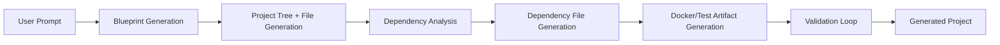

<div align="center">
  
</div>

# AlphaStack

AlphaStack is an AI-powered project generator that converts natural language prompts into multi-file codebases, then validates the result through dependency analysis and a build/test pipeline.

## What AlphaStack does

- Generates a complete project blueprint from a user prompt.
- Builds a project tree and generates file contents in parallel.
- Analyzes internal and external dependencies across generated files.
- Generates dependency manifests (for example `requirements.txt`, `package.json`, `Cargo.toml`) based on detected usage.
- Creates validation artifacts (`Dockerfile`, `.dockerignore`, generated tests, or `run_tests.sh` for CUDA mode).
- Runs iterative validation and correction loops during Docker/shell testing.

## Pipeline overview


```mermaid
graph LR
    A[User Prompt] --> B[Blueprint Generation]
    B --> C[Project Tree + File Generation]
    C --> D[Dependency Analysis]
    D --> E[Dependency File Generation]
    E --> F[Docker/Test Artifact Generation]
    F --> G[Validation Loop]
    G --> H[Generated Project]
```

## Installation

### Requirements

- Python 3.9+
- Optional: Docker (recommended for full validation)

### Install from source

```bash
git clone https://github.com/HyperKuvid-Labs/alpha-stack.git
cd alpha-stack
pip install .
```

### Optional development extras

```bash
pip install .[dev]
```

## Configuration

Provider defaults are configured in `src/providers.json`.

- Default provider: `openrouter`
- Available providers: `google`, `openai`, `openrouter`, `prime_intellect`, `vllm`

Set provider API keys with environment variables:

- `GOOGLE_API_KEY`
- `OPENAI_API_KEY`
- `OPENROUTER_API_KEY`
- `PRIME_API_KEY`
- `VLLM_API_KEY`

For Gemini, you can also run:

```bash
alphastack setup
```

This stores the key in `~/.alphastack/config.json`.

## Usage

### Interactive mode

```bash
alphastack
```

Interactive mode asks for:

- Project prompt
- Output directory
- Language profile (`cuda` or `others`)

### CLI mode

```bash
# Generate a project
alphastack generate "FastAPI service with PostgreSQL"

# Custom output directory
alphastack generate "Rust CLI log analyzer" -o ./created_projects

# Choose provider explicitly
alphastack generate "Go REST API" -p openrouter

# Choose language profile
alphastack generate "CUDA matrix operations" -l cuda
```

Other commands:

```bash
# List generated projects
alphastack list

# Clean generated projects
alphastack clean

# Clean without confirmation
alphastack clean -f
```

## Source layout

The implementation in `src/` is organized as follows:

```text
src/
├── __init__.py
├── cli.py                     # Command-line entrypoint and command handlers
├── config.py                  # Local config management (~/.alphastack/config.json)
├── generator.py               # Core end-to-end generation pipeline
├── providers.json             # Provider + model configuration
├── tui.py                     # Interactive terminal UI (Rich + prompt_toolkit)
├── agents/                    # Reserved package (currently no active modules)
├── docker/
│   ├── __init__.py
│   ├── eval_generator.py      # Evaluation-time Docker/test artifact generator
│   ├── generator.py           # Dockerfile/.dockerignore/test-file generation
│   └── testing.py             # Docker/shell validation pipeline and correction loop
├── prompts/
│   ├── *.j2                   # Blueprint, file generation, planner/corrector, Docker templates
│   └── eval/                  # Language-specific evaluation prompt sets
└── utils/
    ├── __init__.py
    ├── corrector_tool.py
    ├── dependencies.py        # Dependency graph + analysis
    ├── dependency_file_generator.py
    ├── error_tracker.py       # Error/change tracking
    ├── helpers.py
    ├── inference.py           # Provider abstraction + model calls
    ├── prompt_manager.py      # Jinja2 template loading/rendering
    ├── thread_memory.py
    ├── tool_call_log.py
    ├── tool_definitions.py
    ├── tools.py
    └── treesitter_parser.py
```

## Evaluation assets

Prompt-based evaluation tasks are included under `src/prompts/eval/` for:

- CUDA
- Go
- Rust
- TypeScript

Additional evaluation scripts and artifacts are also available in the top-level `eval/` directory.

## Notes on validation modes

- For `others` profile, AlphaStack runs Docker build/test validation.
- For `cuda` profile, AlphaStack uses generated shell-based test execution (`run_tests.sh`) to avoid heavy Docker GPU assumptions.

## Contributing

Contributions are welcome. Useful areas include:

- New provider integrations
- Better dependency extraction and coupling analysis
- More robust Docker/test generation templates
- Prompt quality improvements across generation stages
- Bug fixes and reliability improvements

## License

MIT License. See `LICENSE`.