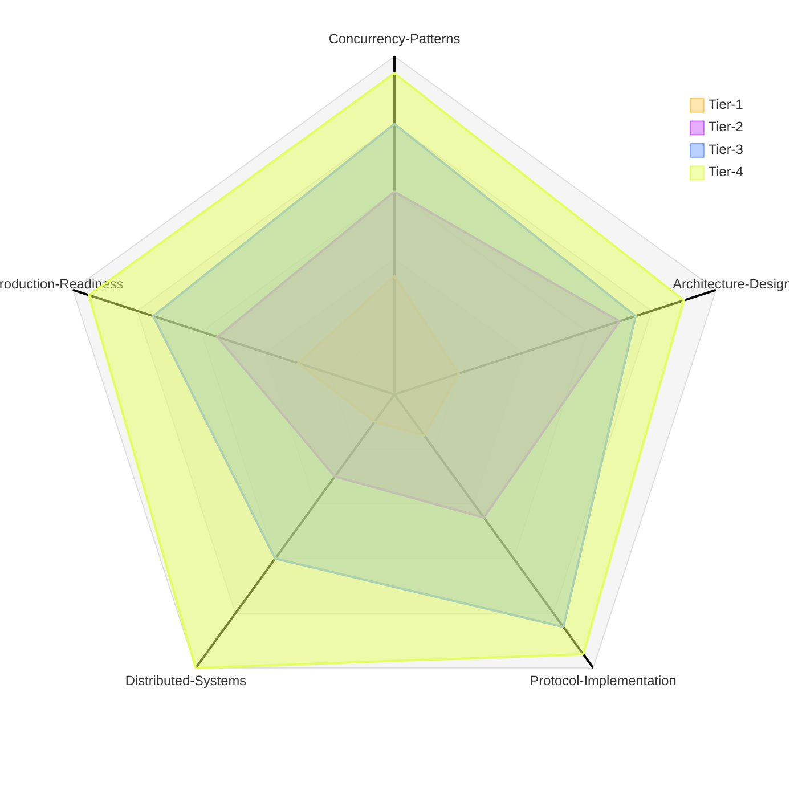

# Go Concurrent Systems Evaluation Suite

This folder contains a comprehensive set of Go programming challenges designed to evaluate proficiency across four difficulty tiers, ranging from fundamental concurrency primitives to complete distributed systems.

## Difficulty Distribution

---

## Challenge Breakdown

### **Tier 1: Concurrency Primitives**

*What it tests:*
- Goroutines and channels
- Basic synchronization (mutex, waitgroups)
- Context cancellation
- Thread-safe data structures

#### **Challenge 1: Concurrent URL Fetcher** (`first.j2`)
**Difficulty:** Beginner
**Topics:** Worker pool pattern, WaitGroups, context cancellation

Builds a CLI tool that fetches URLs concurrently using a bounded worker pool. Tests understanding of:
- Channel-based job distribution
- WaitGroup synchronization for completion tracking
- Context-based timeout and cancellation
- Thread-safe statistics collection with sync.Mutex
- Reusable and unit-testable WorkerPool type
- Latency tracking (min/avg/max) and failure counting

#### **Challenge 2: Token Bucket Rate Limiter** (`second.j2`)
**Difficulty:** Beginner-Intermediate
**Topics:** Rate limiting, channels, time.Ticker, goroutines

Implements an in-process token bucket rate limiter:
- Capacity N tokens with refill rate R tokens/second
- Non-blocking `Allow()` and blocking `Wait()` methods
- Background goroutine with time.Ticker for token refill
- Context support for cancellation during waits
- API client wrapper demonstrating rate limit enforcement
- Tests covering burst behavior, rate compliance, and context cancellation

#### **Challenge 3: Concurrent LRU Cache** (`thrid.j2`)
**Difficulty:** Intermediate
**Topics:** Thread-safe data structures, sync.RWMutex, TTL expiration

Creates an in-memory LRU cache with concurrent access:
- `Get(key)` and `Set(key, value)` operations
- Thread-safe via sync.RWMutex
- Internal doubly linked list (using container/list)
- Optional TTL per key with background expiration goroutine
- Benchmarks comparing single-threaded vs multi-goroutine performance
- Proper resource cleanup via `Close()` method

---

### **Tier 2: Multi-Package Architecture**

*What it tests:*
- Package organization
- Interface design across packages
- Internal imports
- Dependency injection patterns

#### **Challenge 4: Task Manager REST API** (`fourth.j2`)
**Difficulty:** Intermediate
**Topics:** Package organization, interface design, dependency injection

Builds a REST API with clean architecture:
- Four endpoints: POST/GET tasks, GET/DELETE by ID
- Package structure:
  - `api/handlers`: HTTP handlers only
  - `domain`: Task entity and storage interfaces
  - `storage/memory`: In-memory implementation
  - `middleware`: Logging, request ID, auth stub
- Dependency injection via `NewServer(deps...)` constructor
- Unit tests using fake storage implementations
- Demonstrates inversion of control and testability

#### **Challenge 5: Job Queue System** (`fifth.j2`)
**Difficulty:** Intermediate-Advanced
**Topics:** Multi-package coordination, persistence, background workers

Implements a job queue HTTP service with persistence:
- Endpoints: enqueue jobs, poll next job, mark done/failed
- Package architecture: `queue`, `storage`, `api`, `worker`
- Interface-based design for queue operations
- Dual storage: in-memory and file-backed (JSON log)
- sync.Cond or channels for worker wakeup
- Background goroutine for job retry on timeout
- Worker reservation and lease management

#### **Challenge 6: WebSocket Chat Server** (`sixth.j2`)
**Difficulty:** Intermediate-Advanced
**Topics:** WebSocket, hub pattern, goroutine coordination

Creates a multi-room WebSocket chat server:
- Package structure: `hub` (core) and `transport/ws` (WebSocket)
- Per-room management with client sets and broadcast channels
- Goroutines per client for read/write loops
- Hub channels for register, unregister, and broadcast actions
- Room-based message routing
- Transport-agnostic design for future protocol support

---

### **Tier 3: Protocol & Algorithm Implementation**

*What it tests:*
- Network protocol design
- Distributed algorithms
- State machine implementation
- Serialization/deserialization

#### **Challenge 7: Custom RPC Framework** (`seventh.j2`)
**Difficulty:** Advanced
**Topics:** Binary protocols, TCP, concurrent request handling

Builds a TCP-based RPC framework from scratch:
- Custom binary framing: [length(uint32)][payload bytes]
- JSON-based request/response format with IDs
- Server:
  - Method registration by name (e.g., "Add", "Echo")
  - Per-connection goroutine with frame decoder
  - Concurrent request dispatching
- Client:
  - Concurrent call support with response channel map
  - Mutex-guarded pending requests
  - Context support for timeouts and cancellation
- Unit tests for partial frames, timeouts, concurrent requests

#### **Challenge 8: Consistent Hashing Library** (`eight.j2`)
**Difficulty:** Advanced
**Topics:** Distributed algorithms, hash rings, load distribution

Implements consistent hashing with virtual nodes:
- Configurable virtual nodes per physical node
- Operations: AddNode, RemoveNode, GetNode(key)
- Sorted hash ring using sort.Search for O(log n) lookups
- Pluggable hash function interface (FNV-1a, xxhash, etc.)
- Demo program distributing 10,000 keys across N nodes
- Distribution analysis and rebalancing metrics
- Measures key movement percentage on topology changes

#### **Challenge 9: Load Balancer with Health Checks** (`ninth.j2`)
**Difficulty:** Advanced
**Topics:** Reverse proxy, health monitoring, service routing

Builds an HTTP reverse proxy load balancer:
- Strategies: round-robin and consistent-hash based
- Periodic health checks via background goroutines
- Automatic node removal/restoration based on health
- Context-based per-request timeout and cancellation
- JSON/YAML configuration for backends and strategy
- Metrics exposure:
  - Requests per backend
  - Failures per backend
  - Health status tracking

---

### **Tier 4: Distributed Systems**

*What it tests:*
- Consensus protocols
- Fault tolerance
- Service coordination
- Eventual consistency

#### **Challenge 10: Raft Consensus Implementation** (`tenth.j2`)
**Difficulty:** Expert
**Topics:** Consensus protocols, leader election, log replication, state machines

Implements a simplified Raft consensus algorithm:
- Focus on leader election and log replication (no snapshots/compaction)
- Three states: follower, candidate, leader
- In-memory or loopback TCP communication between nodes
- Goroutines with time.Timer for election timeout and heartbeats
- Persistent state: current term, voted-for, log entries
- Command submission interface via leader
- Graceful shutdown with context.Context
- Demo showing leader failure, re-election, and continued replication
- Verifies replicated log consistency across all nodes

---

## Skill Assessment Matrix

| Challenge | Tier | Concurrency | Packages | Network | Complexity | Lines of Code (Est.) |
|-----------|------|-------------|----------|---------|------------|---------------------|
| 1. URL Fetcher | 1 | Goroutines, Channels, WaitGroup | 1 | HTTP Client | O(n) | 150-250 |
| 2. Rate Limiter | 1 | Goroutines, Channels, Ticker | 1 | None | O(1) | 200-300 |
| 3. LRU Cache | 1 | Mutex, RWMutex | 1 | None | O(1) | 250-350 |
| 4. REST API | 2 | Basic | 4-5 | HTTP Server | O(n) | 400-600 |
| 5. Job Queue | 2 | Channels, Cond | 4 | HTTP | O(n) | 500-700 |
| 6. WebSocket Chat | 2 | Hub Pattern | 2-3 | WebSocket | O(n·m) | 400-600 |
| 7. RPC Framework | 3 | Concurrent Calls | 3-4 | TCP | O(n) | 600-900 |
| 8. Consistent Hash | 3 | Basic | 2 | None | O(log n) | 300-500 |
| 9. Load Balancer | 3 | Health Checks | 3-4 | HTTP Proxy | O(n) | 500-800 |
| 10. Raft Consensus | 4 | Timers, State Machine | 4-5 | TCP/Channels | O(n²) | 1000-1500 |