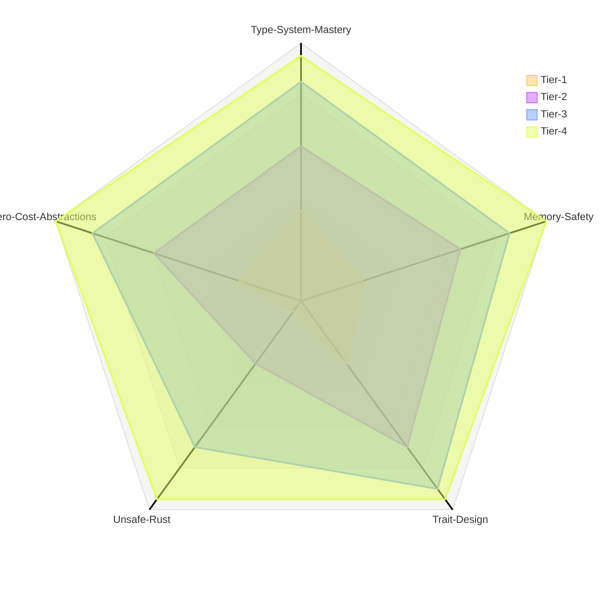

# Rust Systems Programming Evaluation Suite

This folder contains a comprehensive set of Rust programming challenges designed to evaluate proficiency across four difficulty tiers, ranging from fundamental language features to advanced systems programming concepts.

## Difficulty Distribution

---

## Challenge Breakdown

### **Tier 1: Language Fundamentals & Ownership**

*What it tests:*
- Iterator trait implementation
- Ownership and borrowing
- Generic types and trait bounds
- Lifetimes and references

#### **Challenge 1: Custom Range Iterator** (`first.j2`)
**Difficulty:** Beginner
**Topics:** Iterator trait, generics, trait bounds

Implements a custom `StepRange<T>` iterator with configurable step size:
- Generic over numeric types with `T: Add + PartialOrd + Copy`
- Proper `Iterator` trait implementation with associated types
- `filter_even()` method demonstrating iterator chaining
- Edge case handling: zero step, negative ranges, overflow
- Tests for lazy evaluation and composition with standard library adaptors
- Demonstrates iterator consumption with `.collect()`

#### **Challenge 2: Reference-Counted Smart Pointer** (`second.j2`)
**Difficulty:** Beginner-Intermediate
**Topics:** Smart pointers, interior mutability, `Deref` trait

Builds a single-threaded `MyRc<T>` mimicking `std::rc::Rc`:
- Heap allocation using `Box<T>`
- Interior mutability with `Cell<usize>` for reference counting
- `Clone` trait (increments count) and `Drop` trait (decrements, deallocates at zero)
- `Deref` trait for ergonomic access to inner value
- `strong_count()` method for introspection
- Documentation explaining why not `Send` or `Sync`
- Unit tests demonstrating multiple owners and proper cleanup

#### **Challenge 3: Binary Search Tree** (`third.j2`)
**Difficulty:** Intermediate
**Topics:** Recursive data structures, lifetimes, custom iterators

Implements a generic `BinaryTree<T>` where `T: Ord`:
- Operations: `insert()`, `contains()`, and `iter()`
- `Box<Node<T>>` for heap allocation of tree nodes
- Lifetime-correct iterator implementation borrowing the tree
- In-order traversal iterator using stack-based approach
- Duplicate insertion handling with defined behavior
- Tests for empty tree iteration and sorted order verification
- Demonstrates recursive or iterative traversal patterns

---

### **Tier 2: Module Architecture & Advanced Traits**

*What it tests:*
- Multi-module project organization
- Zero-copy parsing with lifetimes
- State machine implementation
- Custom error types with trait implementations

#### **Challenge 4: HTTP Request Parser** (`fourth.j2`)
**Difficulty:** Intermediate
**Topics:** State machines, lifetimes, error handling, zero-copy parsing

Builds an incremental HTTP/1.1 request parser:
- Module structure: `parser`, `types`, `error`
- State machine: RequestLine → Headers → Body → Complete
- `feed(&mut self, &[u8])` method for incremental parsing
- Returns `Result<Option<Request>, ParseError>` (None = need more data)
- Zero-copy design using lifetimes to borrow from input buffer
- nom or hand-written parser combinators
- Custom error type implementing `Display` and `Error` traits
- Tests for valid requests, malformed input, and streaming partial data

#### **Challenge 5: Single-Threaded Async Executor** (`fifth.j2`)
**Difficulty:** Intermediate-Advanced
**Topics:** Futures, async/await, custom executors

Creates a minimal async executor without external runtimes:
- `Executor` with task queue using `VecDeque`
- Custom `Waker` that re-enqueues tasks when woken
- `block_on(future)` function driving futures to completion
- `TimerFuture` demonstrating delayed completion with `Instant`
- Multiple concurrent tasks with cooperative multitasking
- Uses `std::task::{Context, Poll, Wake}`
- Documentation of limitations (no I/O, timer-based only)
- Demonstrates future composition with `.await`

#### **Challenge 6: Lock-Free Ring Buffer** (`sixth.j2`)
**Difficulty:** Intermediate-Advanced
**Topics:** Atomics, lock-free data structures, memory ordering

Implements a bounded lock-free SPSC queue:
- `try_push()` and `try_pop()` non-blocking operations
- `AtomicUsize` for head/tail indices
- `UnsafeCell` or `MaybeUninit` array for storage
- Proper memory ordering: `Ordering::Acquire` / `Ordering::Release`
- Single-threaded correctness tests
- Multi-threaded stress tests with producer/consumer threads
- Zero allocation after initialization
- Implements `Send + Sync` for thread safety

---

### **Tier 3: Macros & Advanced Type System**

*What it tests:*
- Procedural macro authoring
- Typestate pattern for compile-time safety
- Trait object design
- Serialize/deserialize implementations

#### **Challenge 7: Validation Derive Macro** (`seventh.j2`)
**Difficulty:** Advanced
**Topics:** Procedural macros, syn, quote, attribute parsing

Creates `#[derive(Validate)]` macro generating validation methods:
- Attributes: `#[validate(range(min, max))]`, `#[validate(length(min))]`, `#[validate(email)]`
- Generates `validate(&self) -> Result<(), Vec<String>>` method
- Uses `syn` for parsing field attributes
- Uses `quote!` for code generation
- Collects all validation errors, not just first
- Email validation using simple regex
- Tests showing macro expansion with `cargo expand`
- Runtime validation demonstrations

#### **Challenge 8: Typestate HTTP Builder** (`eigth.j2`)
**Difficulty:** Advanced
**Topics:** Typestate pattern, PhantomData, zero-cost abstractions

Implements compile-time safe HTTP request builder:
- States: `NoUrl`, `HasUrl`, `Ready` as phantom type parameters
- State transitions: `new()` → `url()` → `header()` → `send()`
- `.send()` only compiles when URL is set
- `PhantomData<T>` for zero-cost state tracking
- Each method consumes `self` and returns next state
- Compiler errors when trying to `.send()` without `.url()`
- Verification of zero runtime overhead with `size_of` or assembly inspection
- Demonstrates type-level state machines

#### **Challenge 9: JSON Serializer** (`ninth.j2`)
**Difficulty:** Advanced
**Topics:** Trait design, generics, recursive structures, derive macros

Builds a custom JSON serialization library:
- `Serialize` trait with `serialize(&self, serializer: &mut Serializer)` method
- Implementations for primitives, `String`, `Vec<T>`, `Option<T>`, structs
- Support for generic types: `Vec<T: Serialize>`
- Handles recursive/nested structures
- Optional derive macro `#[derive(Serialize)]` for structs
- Tests for primitive types and nested structures
- Round-trip validation using `serde_json` for verification

---

### **Tier 4: Unsafe Rust & Systems Programming**

*What it tests:*
- Raw pointer manipulation
- Memory layout and alignment
- Global allocator implementation
- Unsafe abstractions with safe interfaces

#### **Challenge 10: Bump Allocator** (`tenth.j2`)
**Difficulty:** Expert
**Topics:** Unsafe Rust, memory allocation, GlobalAlloc trait

Implements a bump allocator as a global allocator:
- Fixed-size buffer with pointer increment allocation strategy
- `GlobalAlloc` trait implementation (`alloc`, `dealloc`)
- Raw pointer manipulation with proper alignment handling
- No deallocation (bump pointer only moves forward)
- Tracks allocated vs used bytes
- Alignment calculation and padding
- Panic on out-of-memory conditions
- Demo using `#[global_allocator]` in a program
- Allocates `Vec` and `String` using custom allocator
- Statistics reporting at program end
- Tests for alignment correctness and memory exhaustion

---

## Skill Assessment Matrix

| Challenge | Tier | Ownership | Lifetimes | Unsafe | Complexity | Lines of Code (Est.) |
|-----------|------|-----------|-----------|--------|------------|---------------------|
| 1. Iterator | 1 | Basic | None | No | O(n) | 100-200 |
| 2. Smart Pointer | 1 | Advanced | None | Minimal | O(1) | 150-250 |
| 3. BST | 1 | Advanced | Medium | No | O(log n) | 250-400 |
| 4. HTTP Parser | 2 | Medium | Complex | No | O(n) | 400-600 |
| 5. Async Executor | 2 | Advanced | Medium | Minimal | O(n) | 500-700 |
| 6. Lock-Free Queue | 2 | Advanced | None | Yes | O(1) | 300-500 |
| 7. Proc Macro | 3 | Basic | None | No | O(n) | 400-600 |
| 8. Typestate | 3 | Advanced | None | No | O(1) | 200-350 |
| 9. JSON Serializer | 3 | Advanced | Medium | No | O(n) | 500-800 |
| 10. Allocator | 4 | N/A | None | Extensive | O(1) | 300-500 |