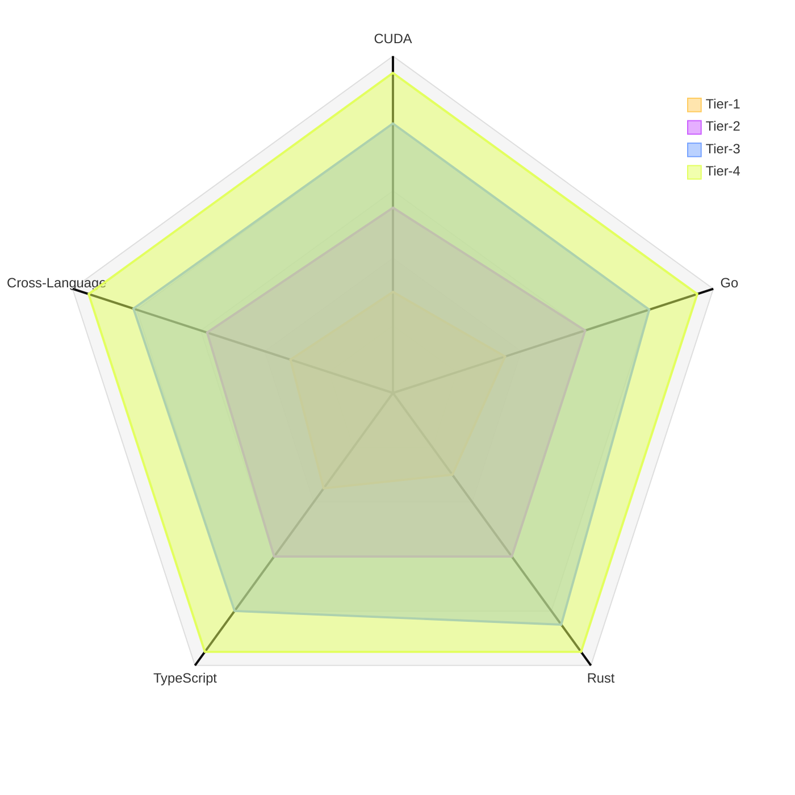

# Programming Language Evaluation Suite

This directory contains comprehensive programming challenges across four modern languages: **CUDA**, **Go**, **Rust**, and **TypeScript**. Each language has 10 carefully designed challenges organized into 4 difficulty tiers, testing progressively advanced concepts from basic syntax to production-ready systems.

## Overview

---

## Language-Specific Focus Areas

### CUDA (GPU Computing)
**Domain:** Parallel computing and GPU acceleration
**Key Concepts:** Memory management, kernel optimization, parallel algorithms
**Challenges:** 10 problems from vector operations to ray tracing engines

### Go (Concurrent Systems)
**Domain:** Distributed systems and concurrency
**Key Concepts:** Goroutines, channels, service architecture
**Challenges:** 10 problems from worker pools to Raft consensus

### Rust (Systems Programming)
**Domain:** Memory-safe systems programming
**Key Concepts:** Ownership, lifetimes, zero-cost abstractions
**Challenges:** 10 problems from iterators to custom allocators

### TypeScript (Type-Safe Applications)
**Domain:** Type system and API design
**Key Concepts:** Generics, type inference, compile-time safety
**Challenges:** 10 problems from event emitters to full-stack RPC

---

## Universal Tier Structure

Each language follows a consistent 4-tier difficulty progression, but tests language-specific skills at each level.

### Tier 1: Fundamentals (Challenges 1-3)

**What ALL Tier 1s Test:**
- Language syntax correctness
- Basic standard library usage
- Simple algorithm implementation

**Language-Specific Focus:**

| Language | Primary Skills |
|----------|---------------|
| **CUDA** | Thread indexing, memory coalescing, kernel launch basics |
| **Go** | Goroutines, channels, WaitGroups, basic synchronization |
| **Rust** | Ownership, borrowing, trait implementation, lifetimes |
| **TypeScript** | Generics, type inference, discriminated unions, basic conditional types |

**Typical Challenges:**
- CUDA: Vector operations, matrix transpose
- Go: Worker pool, rate limiter, concurrent cache
- Rust: Custom iterators, smart pointers, binary search tree
- TypeScript: Event emitter, schema validator, Result/Option types

**Expected Outcomes:**
- Demonstrates language fundamentals
- Shows understanding of core paradigms
- Implements simple, correct solutions
- ~150-400 lines of code per challenge

---

### Tier 2: Architecture & Organization (Challenges 4-6)

**What ALL Tier 2s Test:**
- File organization and module structure
- Internal dependency management
- Interface design and abstraction

**Language-Specific Focus:**

| Language | Primary Skills |
|----------|---------------|
| **CUDA** | Multi-kernel coordination, shared memory, kernel chaining |
| **Go** | Package organization, dependency injection, multi-service coordination |
| **Rust** | Module architecture, zero-copy patterns, state machines |
| **TypeScript** | Template literals, component patterns, type accumulation |

**Typical Challenges:**
- CUDA: Image processing pipeline, multi-stage reduction
- Go: REST API, job queue, WebSocket hub
- Rust: HTTP parser, async executor, lock-free queue
- TypeScript: Type-safe router, component library, state machine

**Expected Outcomes:**
- Clean separation of concerns
- Interface-driven design
- Proper abstraction layers
- ~400-700 lines of code per challenge

---

### Tier 3: Advanced Features & Domain Expertise (Challenges 7-9)

**What ALL Tier 3s Test:**
- Language-specific advanced features
- Complex algorithms without external frameworks
- Domain-specific expertise

**Language-Specific Focus:**

| Language | Primary Skills |
|----------|---------------|
| **CUDA** | Advanced algorithms (sparse matrix, radix sort), irregular parallelism |
| **Go** | Network protocols, distributed algorithms, custom RPC |
| **Rust** | Procedural macros, typestate pattern, unsafe abstractions |
| **TypeScript** | Type-level programming, recursive types, advanced inference |

**Typical Challenges:**
- CUDA: Sparse matrix ops, parallel sorting, Mandelbrot generation
- Go: Custom RPC framework, consistent hashing, load balancer
- Rust: Validation macros, typestate HTTP builder, JSON serializer
- TypeScript: Query builder, DI container, deep path safety

**Expected Outcomes:**
- Advanced language features mastery
- Sophisticated algorithms
- Domain-specific optimizations
- ~500-900 lines of code per challenge

---

### Tier 4: Production Systems (Challenge 10)

**What ALL Tier 4s Test:**
- Complete system architecture
- Performance considerations and optimization
- Production-ready patterns and practices

**Language-Specific Focus:**

| Language | Primary Skills |
|----------|---------------|
| **CUDA** | Full rendering/simulation pipeline, spatial structures, multi-pass algorithms |
| **Go** | Consensus protocols, fault tolerance, distributed coordination |
| **Rust** | Memory management, allocator design, FFI boundaries |
| **TypeScript** | End-to-end type safety, cross-boundary inference, framework design |

**Typical Challenges:**
- CUDA: Ray tracing engine with BVH acceleration
- Go: Raft consensus implementation
- Rust: Custom bump allocator as global allocator
- TypeScript: Full-stack type-safe RPC framework

**Expected Outcomes:**
- Production-quality architecture
- Performance optimization demonstrated
- Error handling and edge cases covered
- Complete documentation and tests
- ~800-1500 lines of code

---

## Difficulty Progression Matrix

| Aspect | Tier 1 | Tier 2 | Tier 3 | Tier 4 |
|--------|--------|--------|--------|--------|
| **Conceptual Complexity** | Single concept | Multiple coordinated concepts | Advanced domain knowledge | Complete systems |
| **Code Organization** | Single file | Multiple modules | Package/crate structure | Multi-package architecture |
| **Testing Requirements** | Basic unit tests | Integration tests | Property/stress tests | End-to-end + benchmarks |
| **Documentation** | Function comments | API documentation | Architecture docs | Complete guides |
| **Time to Complete** | 2-4 hours | 4-8 hours | 8-16 hours | 16-32 hours |
| **Lines of Code** | 150-400 | 400-700 | 500-900 | 800-1500 |

---

## Cross-Language Skill Mapping

Understanding how concepts translate across languages:

### Concurrency & Parallelism
- **CUDA:** Kernel launches, thread blocks, memory synchronization
- **Go:** Goroutines, channels, WaitGroups, sync primitives
- **Rust:** Async/await, futures, Send/Sync traits, atomics
- **TypeScript:** Promises, async/await, event loops (runtime-dependent)

### Memory Management
- **CUDA:** Global/shared/texture memory, coalescing, bank conflicts
- **Go:** Garbage collected, escape analysis, memory pooling
- **Rust:** Ownership, borrowing, lifetimes, manual control
- **TypeScript:** Garbage collected, WeakMap/WeakSet for cleanup

### Type Safety
- **CUDA:** C++ templates, compile-time type checking
- **Go:** Interface satisfaction, structural typing
- **Rust:** Trait system, lifetime bounds, type-state patterns
- **TypeScript:** Structural typing, type inference, conditional types

### Error Handling
- **CUDA:** Error codes, CUDA runtime errors, validation
- **Go:** Multiple return values, error interface, panic/recover
- **Rust:** Result<T, E>, Option<T>, ? operator, type-level safety
- **TypeScript:** Exceptions, discriminated unions, branded types

---