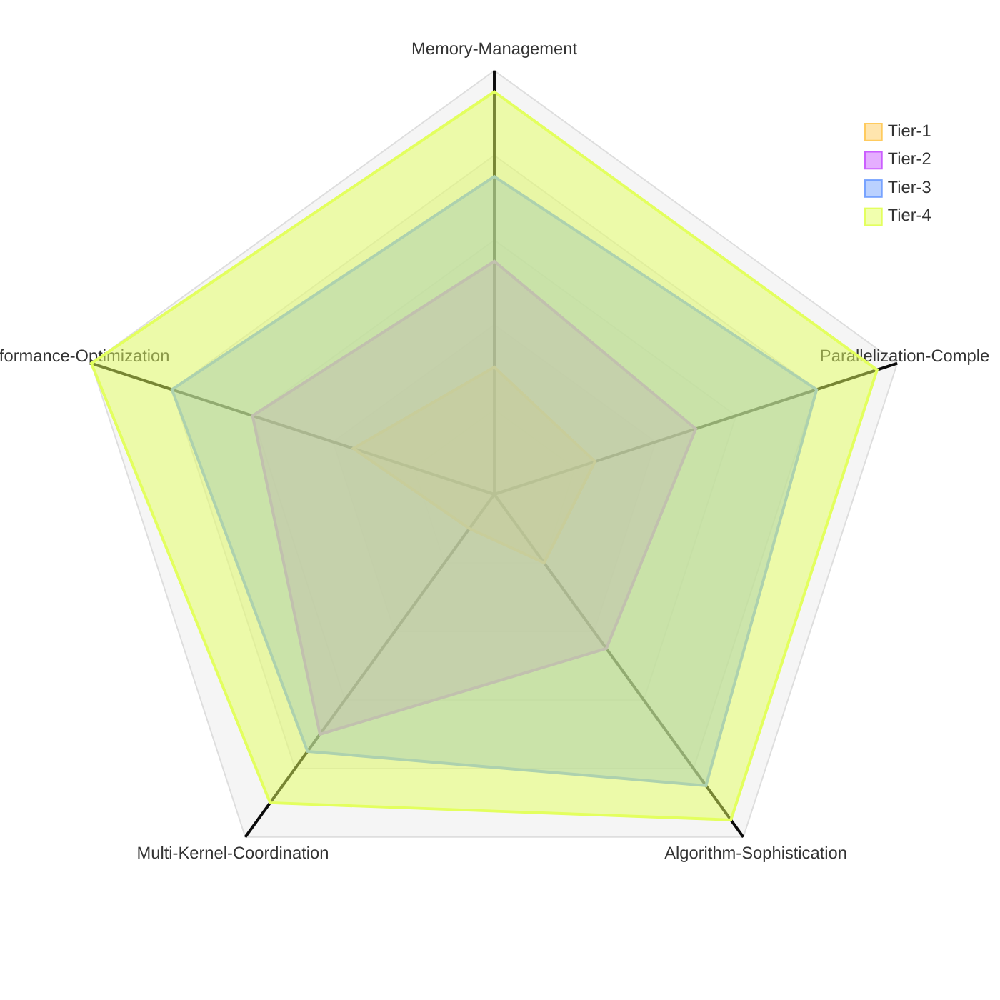

# CUDA Programming Evaluation Suite

This folder contains a comprehensive set of CUDA programming challenges designed to evaluate proficiency across four difficulty tiers, ranging from fundamental kernel concepts to complete GPU applications.

## Difficulty Distribution

---

## Challenge Breakdown

### **Tier 1: Kernel Fundamentals & Memory Basics**

*What it tests:*
- Basic parallel decomposition
- Thread indexing (threadIdx, blockIdx)
- Global memory access patterns
- Simple kernel launch configurations

#### **Challenge 1: Vector Operations** (`first.j2`)
**Difficulty:** Beginner
**Topics:** Element-wise operations, thread indexing, memory coalescing

Implements CUDA kernels for vector addition, multiplication, and dot product on 10^7 elements. Tests understanding of:
- 1D thread/block indexing
- Kernel launch parameter tuning (64, 256, 1024 threads/block)
- Memory coalescing patterns
- Basic error handling and CPU validation

#### **Challenge 2: Matrix Transpose** (`second.j2`)
**Difficulty:** Beginner-Intermediate
**Topics:** 2D indexing, shared memory tiling, bank conflicts

Transposes a 4096×4096 matrix using two approaches:
- Naive global memory implementation
- Optimized shared memory with 32×32 tiles
- Bandwidth utilization profiling
- Handling non-square matrices and edge cases

#### **Challenge 10: Separable Convolution** (`tenth.j2`)
**Difficulty:** Intermediate
**Topics:** 2D convolution, filter separation, memory optimization

Performs 2D Gaussian convolution on 512×512 images:
- Separates into horizontal and vertical 1D passes
- Shared memory caching with halo regions
- Comparison against naive 2D convolution
- Variable kernel sizes (5×5, 9×9)

---

### **Tier 2: Multi-Kernel Coordination & Shared Memory**

*What it tests:*
- Multiple kernel files working together
- Shared memory usage
- Kernel chaining/composition
- Header/implementation separation

#### **Challenge 3: Image Processing Pipeline** (`third.j2`)
**Difficulty:** Intermediate
**Topics:** Multi-kernel coordination, filter chains, synchronization

Builds a three-stage image processing pipeline:
- Gaussian blur (5×5 kernel)
- Sobel edge detection (3×3)
- Histogram equalization
- Separate .cu files per kernel with shared headers
- Compares multi-kernel vs. fused kernel approaches
- Analyzes kernel launch overhead

#### **Challenge 4: Multi-Stage Reduction** (`fourth.j2`)
**Difficulty:** Intermediate
**Topics:** Parallel reduction, warp primitives, shared memory

Implements reduction operations on 10^8 elements with three optimization levels:
- Basic reduction with divergent branches
- Warp shuffle instructions for warp-level reductions
- Sequential addressing to avoid bank conflicts
- Chained kernels for mean and standard deviation in single pass

#### **Challenge 9: Spatial Partitioning System** (`ninth.j2`)
**Difficulty:** Intermediate-Advanced
**Topics:** Spatial hashing, multi-kernel pipelines, neighbor search

Creates a 2D particle system (10,000 particles) with short-range forces:
- Three-kernel architecture: grid assignment → force computation → position update
- 32×32 uniform spatial grid
- Shared memory for neighbor queries
- Demonstrates 100× speedup over naive O(n²) approach

---

### **Tier 3: Advanced Algorithms & Data Structures**

*What it tests:*
- Complex parallel algorithms
- Irregular memory access patterns
- Custom data structure implementations on GPU
- Numerical algorithms

#### **Challenge 5: Sparse Matrix Operations** (`fifth.j2`)
**Difficulty:** Advanced
**Topics:** CSR format, irregular parallelism, load balancing

Implements SpMV (Sparse Matrix-Vector multiplication) with CSR format:
- Handles matrices with >10^6 non-zero elements
- Three parallelization strategies:
  - One thread per row (short rows)
  - Warp per row (medium rows)
  - Block per row (long rows)
- Automatic load balancing based on row length distribution
- Bandwidth and GFLOPS reporting

#### **Challenge 6: Parallel Radix Sort** (`sixth.j2`)
**Difficulty:** Advanced
**Topics:** Sorting algorithms, prefix sum, multi-pass coordination

Sorts 10^7 32-bit integers using radix sort:
- 4-bit or 8-bit radix passes
- Three phases per pass: histogram → prefix sum → redistribution
- Shared memory for local histograms
- Comparison against CUDA Thrust
- Scalability testing with varied distributions (uniform, sorted, reverse)

#### **Challenge 8: Mandelbrot Set Visualization** (`eigth.j2`)
**Difficulty:** Intermediate-Advanced
**Topics:** Dynamic parallelism, fractal generation, adaptive refinement

Generates 1920×1080 Mandelbrot visualization:
- Per-pixel escape time computation (max 256 iterations)
- Dynamic parallelism for adaptive refinement
- Color mapping based on iteration count
- Interactive zoom/pan support

---

### **Tier 4: Complete GPU Applications**

*What it tests:*
- Full rendering/simulation pipelines
- Spatial data structures
- Multi-pass algorithms
- Performance optimization

#### **Challenge 7: Ray Tracing Engine** (`seventh.j2`)
**Difficulty:** Expert
**Topics:** BVH traversal, ray tracing, texture memory, recursive algorithms

Builds a complete GPU ray tracer:
- Renders scenes with 100+ spheres
- CPU-side BVH construction, GPU-side traversal
- Diffuse and reflective materials
- Recursive ray bouncing (depth limit 5)
- BVH stored in texture memory for cache optimization
- 1920×1080 output with rays/second metrics
- Debug visualization mode for BVH traversal

---

## Skill Assessment Matrix

| Challenge | Tier | Memory Types | Synchronization | Algorithm Complexity | Lines of Code (Est.) |
|-----------|------|--------------|-----------------|---------------------|---------------------|
| 1. Vector Operations | 1 | Global | None | O(n) | 150-200 |
| 2. Matrix Transpose | 1 | Global, Shared | Block-level | O(n²) | 200-300 |
| 10. Separable Convolution | 1 | Global, Shared | Block-level | O(n²) | 250-350 |
| 3. Image Pipeline | 2 | Global, Shared | Device-level | O(n²) | 400-600 |
| 4. Multi-Stage Reduction | 2 | Global, Shared | Device+Warp | O(n) → O(log n) | 300-450 |
| 9. Particle System | 2 | Global, Shared | Device-level | O(n) | 400-550 |
| 5. Sparse Matrix Ops | 3 | Global | Block-level | O(nnz) | 500-700 |
| 6. Radix Sort | 3 | Global, Shared | Device-level | O(k·n) | 600-800 |
| 8. Mandelbrot | 3 | Global | Dynamic | O(n·iter) | 300-400 |
| 7. Ray Tracer | 4 | Global, Texture | None | O(rays·depth) | 800-1200 |