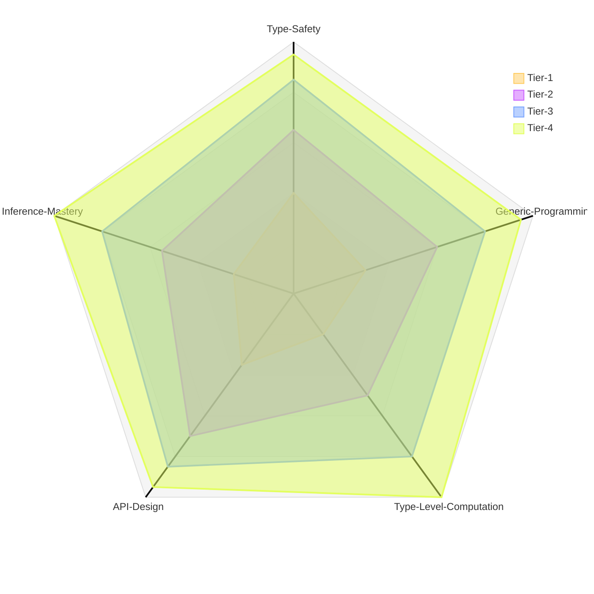

# TypeScript Type System Evaluation Suite

This folder contains a comprehensive set of TypeScript programming challenges designed to evaluate proficiency across four difficulty tiers, ranging from fundamental type safety to advanced type-level programming.

## Difficulty Distribution

---

## Challenge Breakdown

### **Tier 1: Type Foundations & Generics**

*What it tests:*
- Generic type parameters
- Type inference
- Union and discriminated unions
- Conditional types (basic)

#### **Challenge 1: Typed Event Emitter** (`first.j2`)
**Difficulty:** Beginner
**Topics:** Generics, mapped types, type constraints

Builds a strongly-typed event emitter with compile-time payload validation:
- Generic `EventMap` type with event names as keys and payloads as values
- Type-safe `on<K extends keyof Events>()` with inferred payload types
- Type-safe `emit<K extends keyof Events>()` enforcing correct payloads
- Support for `once()` and `off()` methods
- Compiler errors when passing wrong payload types
- Tests for multiple listeners per event and cleanup
- Demonstrates mapped types and keyof operator

#### **Challenge 2: Schema Validation with Type Inference** (`second.j2`)
**Difficulty:** Beginner-Intermediate
**Topics:** Type inference, conditional types, builder pattern

Creates a validation library similar to Zod with full type inference:
- Chainable validators: `.string()`, `.number()`, `.object()`, `.array()`
- Refinements: `.min()`, `.max()`, `.email()`, `.optional()`
- Type inference using `infer` keyword and conditional types
- Result type: `{ success: true, data: T } | { success: false, errors: string[] }`
- Schema composition for nested objects
- Tests for nested object and array validation
- Type inference correctness verification

#### **Challenge 3: Result and Option Monads** (`third.j2`)
**Difficulty:** Intermediate
**Topics:** Discriminated unions, type guards, functional programming

Implements functional `Result<T, E>` and `Option<T>` types:
- `Result<T, E>` with `.map()`, `.mapErr()`, `.andThen()`, `.unwrap()`
- `Option<T>` with `.some()`, `.none()`, `.map()`, `.filter()`, `.unwrap()`
- Type guards: `.isOk()`, `.isErr()`, `.isSome()`, `.isNone()` narrow types
- Discriminated unions: `{ kind: 'ok', value: T }` (no runtime classes)
- Chainable transformations and error propagation
- Tests for type narrowing in conditionals
- Demonstrates functional error handling patterns

---

### **Tier 2: Advanced Generics & Component Patterns**

*What it tests:*
- Template literal types
- Recursive type definitions
- Component typing (React)
- Complex generic constraints

#### **Challenge 4: Type-Safe Router** (`fourth.j2`)
**Difficulty:** Intermediate
**Topics:** Template literal types, path parsing, type-level string manipulation

Builds a router with fully typed route paths and parameters:
- Template literal types to parse route patterns like `/users/:userId`
- Extract parameter names into typed objects: `{ userId: string }`
- Type-safe `navigate()` and `link()` functions
- Support for query parameters with optional typing
- Module structure: `router/parser.ts`, `router/index.ts`, `router/types.ts`
- Compiler errors for invalid paths
- Tests for route matching and parameter extraction

#### **Challenge 5: Typed Component Library** (`fifth.j2`)
**Difficulty:** Intermediate
**Topics:** React types, generic components, prop validation

Creates a component library with strict prop typing:
- Generic `Button<T>` component for typed onClick events
- `Select<Option>` with typed options array and onChange callback
- `Form<Schema>` with typed field names and validation
- Discriminated unions for variants: `variant: 'primary' | 'secondary'`
- Strict children typing: `children?: React.ReactNode`
- Module structure per component with `.types.ts` files
- Tests using @testing-library/react
- Demonstrates `@ts-expect-error` for invalid prop testing

#### **Challenge 6: Type-Safe State Machine** (`sixth.j2`)
**Difficulty:** Intermediate-Advanced
**Topics:** State machines, discriminated unions, type-level validation

Implements a finite state machine with compile-time transition validation:
- Type map defining states and their data: `States = { idle: {}, loading: { startTime: number } }`
- Type map for valid transitions: `Transitions = { idle: 'START_LOADING', loading: 'LOAD_SUCCESS' | 'LOAD_ERROR' }`
- `.transition()` only accepts valid events for current state
- State data must match target state's shape
- Support for guards/actions executed on transitions
- Tests for valid/invalid transitions
- Demonstrates complex discriminated unions

---

### **Tier 3: Type-Level Programming & Advanced Patterns**

*What it tests:*
- Mapped types and conditional types (advanced)
- Type-level recursion
- Builder patterns with type accumulation
- Dependency injection patterns

#### **Challenge 7: Type-Safe Query Builder** (`seventh.j2`)
**Difficulty:** Advanced
**Topics:** Mapped types, builder pattern, type narrowing

Creates a query builder with schema-driven typing:
- Schema definition with `as const` for literal type inference
- Chainable methods: `.select()`, `.where()`, `.fields()` with type updates
- `.fields()` narrows return type to selected columns only
- Type-safe joins with foreign key validation
- Uses mapped types to convert schema to typed objects
- Conditional types for filtering selected fields
- Tests for field selection narrowing and compiler errors

#### **Challenge 8: Dependency Injection Container** (`eigth.j2`)
**Difficulty:** Advanced
**Topics:** Recursive types, dependency resolution, type-level maps

Builds a DI container with type-checked dependencies:
- `.register(name, factory)` where factory receives typed dependencies
- `.resolve(name)` returns correctly typed service
- Type-level dependency graph using recursive conditional types
- Circular dependency detection at type level
- Factory functions typed as `(deps: PickDeps<T>) => Service`
- Uses `infer` to extract dependency names from parameters
- Tests for singleton vs transient lifetime
- Demonstrates advanced type-level programming

#### **Challenge 9: Deep Path Type Safety** (`ninth.j2`)
**Difficulty:** Advanced
**Topics:** Template literals, recursive types, path extraction

Creates a form library with type-safe deep object paths:
- Paths like `"user.address.city"` are fully type-checked
- `Path<T>` helper generates all valid paths: `"name" | "address.city" | "address.zip"`
- `PathValue<T, P>` extracts value type at path
- Supports nested objects and arrays with indices (`tags.0`, `tags.1`)
- Recursive type traversing entire object structure
- `register()` and `setValue()` methods enforce path and value types
- Tests for complex nested types and compiler errors
- Demonstrates advanced template literal types

---

### **Tier 4: Full-Stack Type Safety & Meta-Programming**

*What it tests:*
- End-to-end type propagation
- Cross-boundary type safety (server/client)
- Complex type inference chains
- Production-ready type system design

#### **Challenge 10: Full-Stack Type-Safe RPC** (`tenth.j2`)
**Difficulty:** Expert
**Topics:** Type inference across boundaries, proxy types, schema integration

Builds a complete RPC framework with server-to-client type propagation:
- Server defines procedures with input validation (integrates Challenge 2)
- Client proxy object with methods matching server procedures
- Automatic type inference: client method returns match server handler returns
- Transport abstraction (in-memory → HTTP)
- Query vs mutation distinction
- Module structure: `server/router.ts`, `client/proxy.ts`, `shared/types.ts`
- End-to-end type safety: server changes reflect immediately in client types
- Input validation errors propagated with types
- Demonstrates the pinnacle of TypeScript's type system capabilities

---

## Skill Assessment Matrix

| Challenge | Tier | Generics | Type-Level | API Design | Complexity | Lines of Code (Est.) |
|-----------|------|----------|------------|------------|------------|---------------------|
| 1. Event Emitter | 1 | Basic | Low | Medium | O(n) | 150-250 |
| 2. Schema Validator | 1 | Medium | Medium | High | O(n) | 300-500 |
| 3. Result/Option | 1 | Medium | Low | High | O(1) | 200-350 |
| 4. Type-Safe Router | 2 | High | High | High | O(n) | 400-600 |
| 5. Component Library | 2 | High | Medium | High | O(1) | 500-800 |
| 6. State Machine | 2 | High | High | Medium | O(1) | 300-500 |
| 7. Query Builder | 3 | Expert | Expert | High | O(n) | 600-900 |
| 8. DI Container | 3 | Expert | Expert | High | O(n) | 500-800 |
| 9. Deep Path Safety | 3 | Expert | Expert | Medium | O(depth) | 400-700 |
| 10. RPC Framework | 4 | Expert | Expert | Expert | O(n) | 800-1200 |
